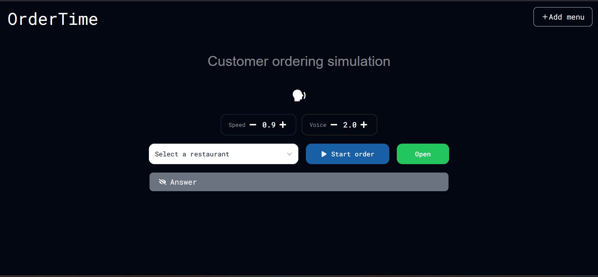

# OrderTime
## Description
OrderTime is a practice platform designed to help users sharpen their listening and order-taking skills before starting a part-time job in a restaurant. The app simulates realistic customer interactions using web voices.
    <p align="center">
    
    
    
    
    
    
    </p>

## Installsation and Activate environment
### 1. Backend  
Navigate to the backend directory, activate the virtual environment, and install dependencies:
```
cd backend
.\ai\Scripts\Activate.ps1
pip install -r requirements.txt
```
### 2. Frontend
Navigate to the frontend directory and install the necessary packages:
```
cd frontend 
npm install
```

## Project preview


### Functions
1. Restaurant Selector: Choose different restaurant environments to practice in.

2. Order Simulation: Click the "Order" button to trigger a customer request.

3. Answer Toggle: Use the Open/Close button to reveal or hide the answer box.

4. Audio Control: Increase voice speed and difficulty for better practice.

5. Realistic Audio: High-quality customer voices to simulate real-world scenarios.

6. Restaurant Management: Allows users to add new restaurants to the simulation

7. Answer box: Allows users to know what food that customer ordered.

### Additonal features
- AI Voice Integration: Uses AI to create natural and realistic conversations.

- Interactive Input: Added text box for answer input and verification.

- Menu Page: View food items and details for all restaurants in one place.

- Item Management: Ability to add single food items.

- Expansion: Easily add single restaurant profiles.

## Connect With Me
I'd love to connect and hear your thoughts on the project!