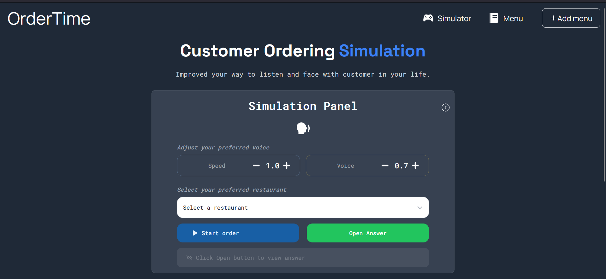
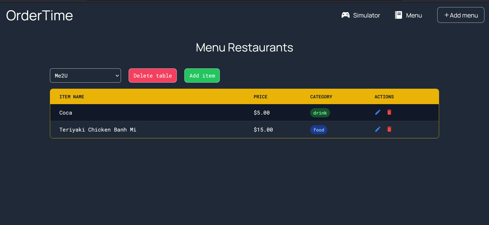

# OrderTime
## Description
OrderTime is a practice platform designed to help users sharpen their listening and order-taking skills before starting a part-time job in a restaurant. The app simulates realistic customer interactions using web voices.
    <p align="center">
    
    
    
    
    
    
    
    </p>

## Installsation and Activate environment
### 1. Backend  
Navigate to the backend directory, activate the virtual environment, and install dependencies:
```
cd backend
.\ai\Scripts\Activate.ps1
pip install -r requirements.txt
```

Run ```uvicorn main:app --reload``` while running the frontend.

### 2. Frontend
Navigate to the frontend directory and install the necessary packages:
```
cd frontend 
npm install
```
Run ```npm start``` while running the backend.

## Live Demo
Still working on.....

## Project preview
### Homepage



| Feature | Description |
|---|---|
| **Restaurant Selector** | Choose different restaurant environments to practice in |
| **Order Simulation** | Trigger a realistic customer request with one click |
| **Answer Toggle** | Reveal or hide the answer box using the Open/Close button |
| **Audio Control** | Adjust voice speed and pitch to increase difficulty |
| **Realistic Audio** | High-quality customer voices that simulate real-world scenarios |
| **Restaurant Management** | Add new restaurants directly into the simulation |
| **Answer Box** | See exactly what the customer ordered after submitting |
| **AI Voice Integration** | Natural conversations powered by ElevenLabs AI |
| **Interactive Input** | Type in orders and verify your answers in real time |
| **Instructions** | Toggle the `?` icon near "Simulation Panel" heading anytime for a quick how-to guide |

### Menu Table Page


| Feature | Description |
|---|---|
| **CRED Control Items** |  Ability to create, read, edit and delete items of the restaurant. |
| **Table Management** | Ability to delete the table. |

### Additonal features

- CRED Control Restaurant: Easily add and edit single restaurant profile.
- Authentication: Apply login and signup for user to create their own restaurant.

## Connect With Me
I'd love to connect and hear your thoughts on the project!